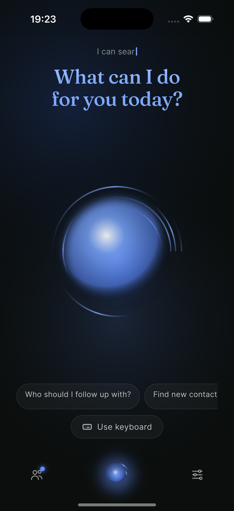
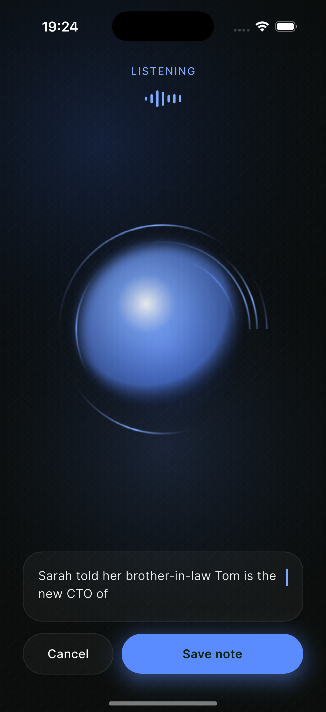
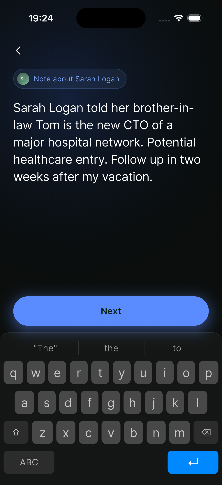
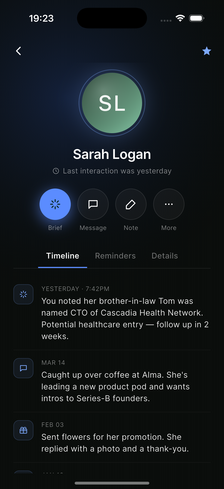
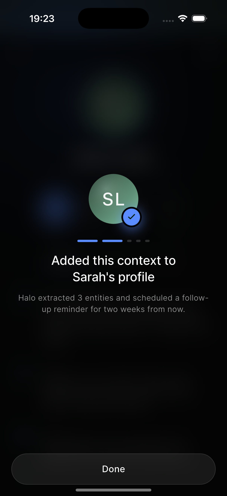
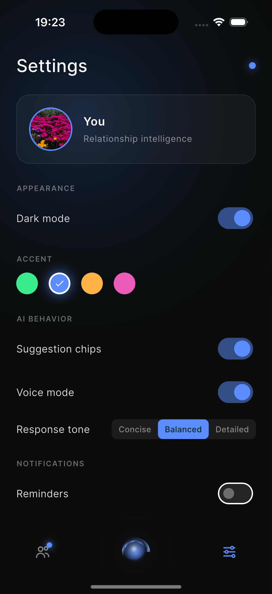

# Halo — AI Relationship Assistant

A Flutter app that acts as an intelligent relationship manager: brief you before meetings, surface follow-ups, and help you stay close to the people who matter.

---

## Screens

| Home | Listen | Note |
|------|--------|------|
|  |  |  |

| Contact | Confirm | Settings |
|---------|---------|----------|
|  |  |  |

---

## Features

### Dark / Light Mode
Full dual-theme support via `HaloTheme extends ThemeExtension<HaloTheme>`. Every screen adapts — surface colors, card surfaces, borders, text, and accent treatments all shift correctly between modes.

Switching dark mode triggers a **circular reveal animation**: the current screen is captured, an overlay expands a clipping circle from the toggle's position to reveal the newly themed UI underneath.

### Accent Colors
Four accent palettes — **Fern** (green), **Cobalt** (blue), **Amber** (orange), **Magenta** (pink) — each with five tonal variants (`line`, `glow`, `glowMid`, `core`, `solid`). Accents drive the animated orb, ambient glow gradients, chip highlights, and badge colors throughout the app.

In dark mode, accent `line` colors glow against dark surfaces. In light mode, those same elements fall back to neutral `muted()` tones so nothing washes out.

### Animated Orb
A `CustomPainter`-rendered orb on the Home screen responds to touch and pulses with the current accent color. Tapping it navigates to the Listen (voice) screen.

### Voice Input
The Listen screen activates microphone input with an animated waveform. A settings toggle enables/disables voice mode entirely.

### Keyboard / Text Input
The Note screen provides a full custom iOS-style keyboard with accent-tinted suggestion chips and a blinking caret, for composing queries or notes without voice.

### Contacts & People
The People screen groups contacts alphabetically with avatar initials, snippet text, and due-date reminder badges. Tapping a contact opens the Contact detail page with a tabbed view (Timeline, Reminders, Details) and quick-action buttons.

### Suggestions
The Home screen surfaces contextual suggestion chips (configurable in Settings). Tapping any chip navigates to the Listen screen.

---

## Architecture

Clean Architecture with BLoC state management:

```
lib/
├── core/
│   ├── app_keys.dart         — shared GlobalKeys (RepaintBoundary for reveal)
│   └── theme/
│       ├── halo_theme.dart   — HaloTheme ThemeExtension (dark + light presets)
│       └── colors.dart       — AccentColors palette definitions
├── domain/
│   ├── entities/             — Contact, etc.
│   └── repositories/         — abstract repository contracts
├── data/
│   ├── models/               — JSON-serializable models
│   └── repositories/         — concrete implementations
├── presentation/
│   ├── bloc/
│   │   ├── halo_bloc.dart    — screen navigation + contact/accent state
│   │   ├── settings_cubit.dart — dark mode, voice, suggestions toggles
│   │   └── ...
│   ├── pages/                — one file per screen
│   └── widgets/              — OrbWidget, AvatarWidget, HaloNavBar, etc.
├── app.dart                  — MaterialApp + theme wiring + shell
├── injection_container.dart  — get_it DI registration
└── main.dart
```

### Theme System

`HaloTheme` exposes five design tokens and a helper:

| Token | Dark | Light |
|-------|------|-------|
| `surface` | `#0A0D0B` | `#F2F7F4` |
| `cardSurface` | white @ 4% | white @ 70% |
| `borderColor` | white @ 8% | black @ 8% |
| `onSurface` | `#FFFFFF` | `#0D1A12` |
| `ambientGlow` | `true` | `false` |

`t.muted(opacity)` returns `onSurface.withValues(alpha: opacity)` — the single primitive used for all subdued text and icon colors.

`t.ambientGlow` is the in-widget gate for accent vs. neutral treatment: `true` keeps accent colors alive; `false` falls back to `t.muted()`.

### Circular Reveal Animation

Toggling dark mode in Settings:

1. Captures the current shell via `RepaintBoundary.toImage()`
2. Inserts an `OverlayEntry` showing the frozen screenshot
3. Updates the theme (new theme renders underneath on the next frame)
4. Animates a `ClipPath` circle expanding from the toggle's position using `Path.combine(PathOperation.difference, fullRect, circle)` — revealing the new theme as it grows

---

## Tech Stack

| Package | Role |
|---------|------|
| `flutter_bloc` | BLoC / Cubit state management |
| `google_fonts` | Inter, Fraunces, Urbanist typefaces |
| `get_it` | Dependency injection |
| `dartz` | `Either<Failure, T>` functional error handling |
| `shared_preferences` | Persisting settings (dark mode, accent, toggles) |
| `equatable` | Value equality for BLoC states/events |

---

## Getting Started

```bash
flutter pub get
flutter run
```

Requires Flutter 3.x and Dart SDK `^3.11.5`.
